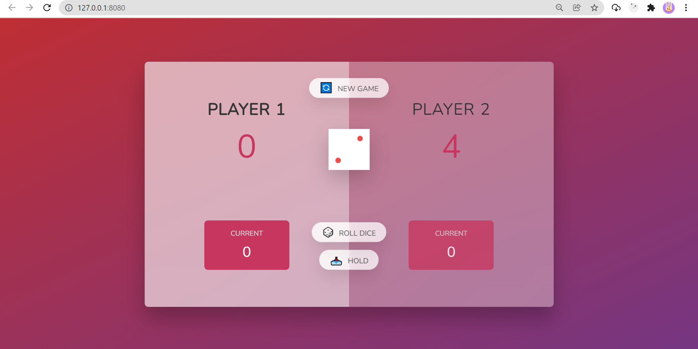

# PIG GAME

> make our time with friends fun

---

### Table of Contents

You're sections headers will be used to reference location of destination.

- [Description](#description)
- [How To Use](#how-to-use)
- [References](#references)
- [Author Info](#author-info)

---

## Description

This app make your time with your friends FUN. The rule is simple, the winner is player has 100 score. Use your strategy to roll dice and hold current dice score because if dice score 1, your current score will reset 0 and your turn is swith to other player. is fun right? [Go Try live demo](https://pig-game-v2.netlify.app/).

#### Technologies

- Javascript
- HTML
- CSS

[Back To The Top](#read-me-template)

---

## How To Use

### Flowchart

[Back To The Top](#read-me-template)

---

## References

- [HTML & CSS](https://github.com/jonasschmedtmann/complete-javascript-course)

[Back To The Top](#read-me-template)

---

## Author Info

- Twitter - [@armerayfrndy](https://twitter.com/armerayfrndy)
- LinkedIn - [@armeray](https://www.linkedin.com/in/armer-ray-aa1b2411b/)

[Back To The Top](#read-me-template)
